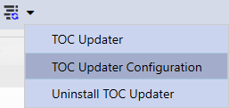
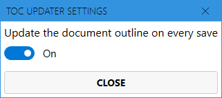

# TOC Updater Addin for Markdown Monster
This is an addin for [Markdown Monster](https://markdownmonster.west-wind.com). 

## Table of Content

<!-- Start Document Outline -->

* [What it does](#what-it-does)
* [Settings](#settings)
* [License](#license)

<!-- End Document Outline -->

## What it does
This addin helps you to keep your document outline, others say table of content, up to date. You may either press the `Button` in the `Toolbar` or let the addin update the TOC whenever you save your file. 

## Settings
1. From the drop down select `TOC Updater Configuration`

    

2. Toggle if your TOC should be updated or not

    
    
## License
[MIT](License.md)